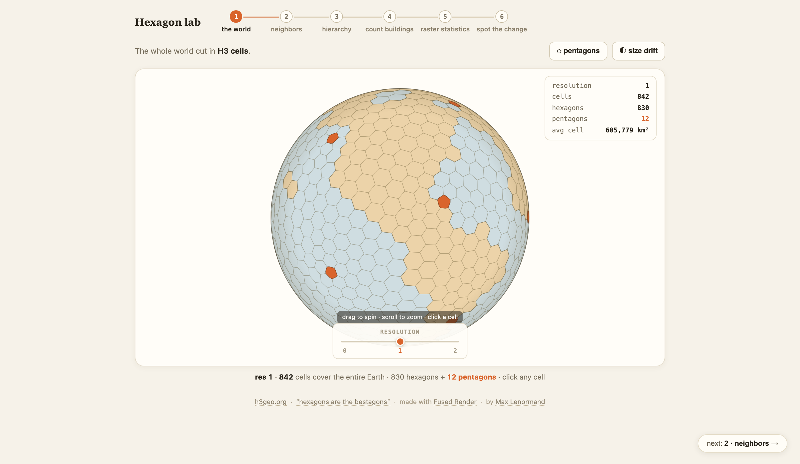
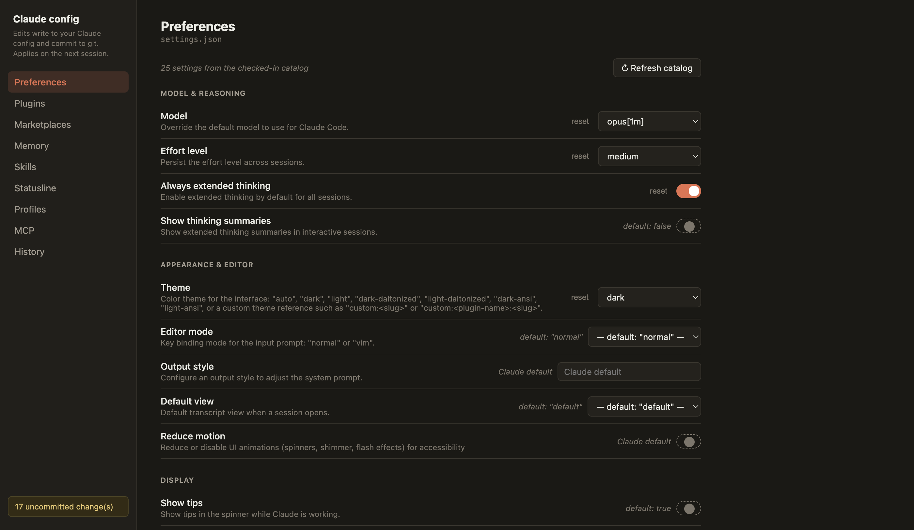
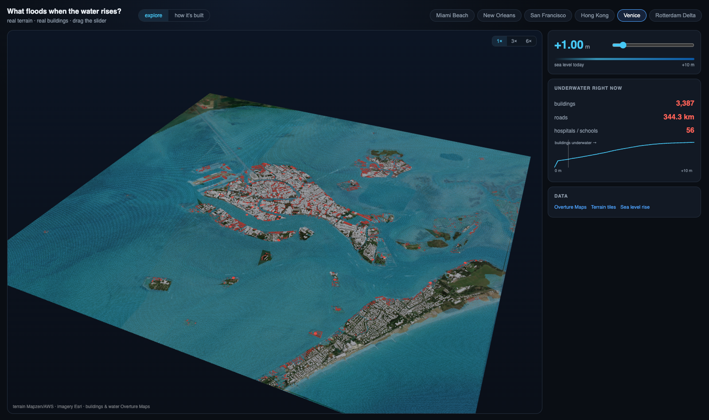
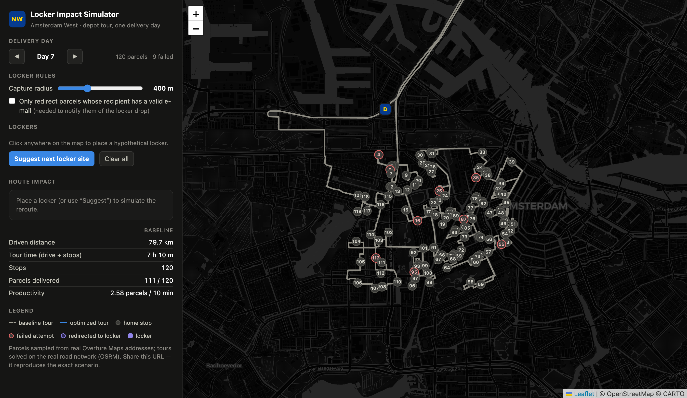
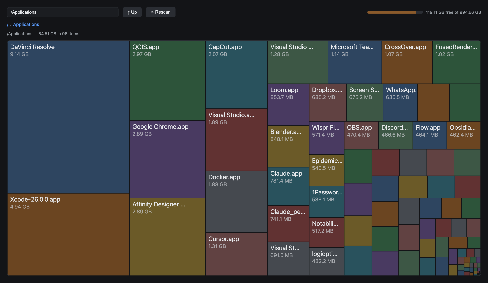

# Fused Render examples

A gallery of example projects for **[Fused Render](https://github.com/fusedio/fused-render)** —
browse them, see what's possible, and copy any one into your own install to
make it your own.

Each example is a self-contained folder: a Python UDF or two plus an HTML view.
No build step. To run one, copy its folder into your Fused Render install and
open the `.html`. Every example works from public data (a few want a free API
key, noted in their README).

## Get Fused Render

- **macOS**: `brew install --cask fusedio/tap/fused-render`, or download the
  DMG from the [releases page](https://github.com/fusedio/fused-render/releases).
- **Windows / Linux**: install the wheel linked in each release's notes
  (`pip install <wheel-url>`, Python 3.10+), then run `fused-render`.

**New here?** Fused Render seeds a minimal sine-wave demo into
`~/Documents/Fused` on first run — that's the smallest possible project (one
`.py`, one `.html`). The smallest example in this gallery is
[disk_usage](local-tools/disk_usage/): the same two-file shape pointed at your
own machine, no setup. Start with either, then browse below.

---

## Highlights

<table>
  <tr>
    <td width="50%"><a href="geospatial/hexagon_lab/"></a><br><b>Hexagon lab</b><br>Six steps from the whole world to one join — an interactive H3 explainer — <a href="https://open.fused.io/mx4yiqseryjfdzl6oc3mwlnx7e">live</a>.</td>
    <td width="50%"><a href="local-tools/visual_claude/"></a><br><b>visual-claude</b><br>A visual settings page for Claude Code, writing to <code>~/.claude</code>.</td>
  </tr>
  <tr>
    <td><a href="geospatial/flood_risk_explorer/"></a><br><b>Flood Risk Explorer</b><br>3D sea-level rise over six coastal cities — drag the slider, close Rotterdam's storm-surge gates.</td>
    <td><a href="geospatial/locker_network_simulator/"></a><br><b>Parcel locker simulator</b><br>Live route re-optimization on real roads.</td>
  </tr>
  <tr>
    <td><a href="local-tools/disk_usage/"></a><br><b>disk_usage</b><br>Treemap disk-space explorer for your local filesystem.</td>
    <td></td>
  </tr>
</table>

---

## Geospatial

| Example | What it does |
|---|---|
| [flood_risk_explorer](geospatial/flood_risk_explorer/) | 3D sea-level-rise explorer: real terrain + Overture buildings, water that floods only what it can reach, and Rotterdam's storm-surge gates |
| [buildings_to_hexagons](geospatial/buildings_to_hexagons/) | Interactive explainer: every building on Earth as H3 hexes ([live](https://open.fused.io/lyxdustnqlwtzlwroowg7c6w3a)) |
| [hexagon_lab](geospatial/hexagon_lab/) | Six-step H3 explainer: globe → neighbors → hierarchy → buildings → rasters → release diff ([live](https://open.fused.io/mx4yiqseryjfdzl6oc3mwlnx7e)) |
| [cog_range_viewer](geospatial/cog_range_viewer/) | Stream a huge COG with HTTP range requests, no download ([live](https://open.fused.io/s2ndrn6shzzbawm36gkjhwqrhi)) |
| [zarr_explainer](geospatial/zarr_explainer/) | An interactive 11-step guide to the Zarr format, on real NASA ocean data ([live](https://open.fused.io/mjyttte444gnh4sye2bzjgd5f4)) |
| [cog_overview_pyramid](geospatial/cog_overview_pyramid/) | Every resolution level of a COG as an interactive 3D pyramid ([live](https://open.fused.io/5p5yp52aolmwqks63j7l4e7x3u)) |
| [overture_census_isochrone](geospatial/overture_census_isochrone/) | Isochrone + Overture POIs + Census income on H3 hexes ([live](https://open.fused.io/sx43sjlduoo2r2fvfertxxkoqq)) |
| [zonal_stats_hex](geospatial/zonal_stats_hex/) | Who lives at what elevation — Census × DEM, joined in DuckDB ([live](https://open.fused.io/7c7rnluzsymgnxyoppn75k6eca)) |
| [store_site_selection](geospatial/store_site_selection/) | "Where should I open a cafe?" weighted tract scoring ([live](https://open.fused.io/4yxl5j2nfame2v7elutsm25hde)) |
| [forest_carbon_monitor](geospatial/forest_carbon_monitor/) | Deforestation inside protected areas via Global Forest Watch ([live](https://open.fused.io/qnstptjoep3pv4akfzdtsk63hi)) |
| [locker_network_simulator](geospatial/locker_network_simulator/) | Parcel-locker route optimization on real road networks ([live](https://open.fused.io/wvepmyihwc34qrmgafht2caazy)) |
| [disaster_response_dashboard](geospatial/disaster_response_dashboard/) | Imagery + storm track + buildings fused for a disaster event ([live](https://open.fused.io/xaufw6k4flimptuftjjqiqav54)) |
| [gers_pixel_ref](geospatial/gers_pixel_ref/) | eopix: "a URL for building pixels" — mint/resolve GERS-anchored byte-range references ([live](https://open.fused.io/kmubo2djxutwzc3tuyf3kfvs2y)) |
| [flightdeck](geospatial/flightdeck/) | Live flight-ops suite: lookup, radar, sky, airports, hazards — seven interlinked real-time views ([live](https://unstable.open.fused.io/wihwz3nnlet3avpsr3qa22ywrm?flight=AAL292)) |
| [japan_transit](geospatial/japan_transit/) | National rail map + Dijkstra station-to-station routing for Japan, on GPU-ready columnar binaries |
| [temperature_explorer](geospatial/temperature_explorer/) | Historical daily temperature for any point on Earth, from a free REST API or a cloud-native Zarr store |

## Local tools

Fused Render pointed at your **own machine** instead of the cloud.

| Example | What it does |
|---|---|
| [visual-claude](local-tools/visual_claude/) | A visual settings page for Claude Code (writes to `~/.claude`, git-versioned) |
| [pytop](local-tools/pytop/) | A live `top`-style system + process monitor |
| [disk_usage](local-tools/disk_usage/) | Treemap disk-space explorer and cleaner |
| [db_console](local-tools/db_console/) | Connect to local or remote SQL databases, browse schemas, and draft SQL with AI |
| [notion_db](local-tools/notion_db/) | Notion-style task tracker on a local Parquet lake |
| [comfy](local-tools/comfy/) | A ComfyUI-style node editor with a local image-processing engine |
| [vps_manager](local-tools/vps_manager/) | Manage remote SSH machines — auto-discovered from `~/.ssh/config` and `known_hosts` — with a file browser and terminal |
| [invoice_generator](local-tools/invoice_generator/) | Local invoice manager: clients, line items, numbering, and exchange-rate lookups, stored as plain JSON |
| [download_manager](local-tools/download_manager/) | Multithreaded, resumable download manager with pause/resume, a shared speed limit, and detached workers |

---

## How an example is structured

```
example_name/
  README.md            what it is + how to run
  <udf>.py             Python UDF(s) — the data backend
  <view>.html          the browser view (calls the UDFs via fused.runPython)
  .env.example         only if it needs an API key
```

Each Python file just defines a module-level `main(...)` function — that's the
entry point Fused Render calls, with the view's parameters passed as keyword
arguments. Imports live inside the function body, and any pip dependencies are
declared in a [PEP 723](https://peps.python.org/pep-0723/) header. Data that
takes a while to fetch is cached to disk on first run.

## Notes

- These examples are for exploration and learning. Data sources are public
  (OpenStreetMap, Overture, US Census, Copernicus, Global Forest Watch, Maxar
  Open Data, NOAA); scenarios in the logistics/response demos are illustrative.
- Licensed under [MIT](LICENSE). Want to add an example? See
  [CONTRIBUTING.md](CONTRIBUTING.md) for the folder contract and test harness.
