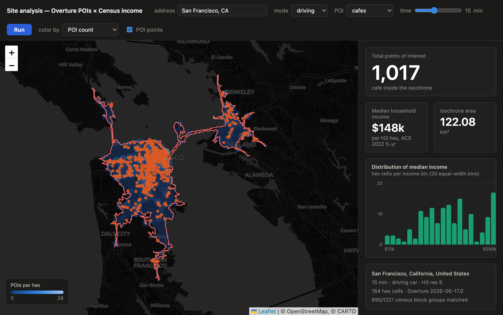

# Fused Render examples

A gallery of example projects for **[Fused Render](https://fused.io)** — browse
them, see what's possible, and copy any one into your own install to make it
your own.

Each example is a self-contained folder: a Python UDF or two plus an HTML view.
No build step. To run one, copy its folder into your Fused Render install and
open the `.html`. Every example works from public data (a few want a free API
key, noted in their README).

---

## Highlights

<table>
  <tr>
    <td width="50%"><a href="geospatial/buildings_to_hexagons/"></a><br><b>Buildings → hexagons</b><br>2.6B buildings in a 0.4 MB file — an interactive explainer.</td>
    <td width="50%"><a href="geospatial/locker_network_simulator/"></a><br><b>Parcel locker simulator</b><br>Live route re-optimization on real roads.</td>
  </tr>
  <tr>
    <td><a href="geospatial/store_site_selection/"></a><br><b>Store site selection</b><br>Score city tracts with instant re-ranking.</td>
    <td><a href="geospatial/overture_census_isochrone/"></a><br><b>Isochrone dashboard</b><br>Routing + POIs + demographics, fused.</td>
  </tr>
</table>

---

## Geospatial

| Example | What it does |
|---|---|
| [buildings_to_hexagons](geospatial/buildings_to_hexagons/) | Interactive explainer: every building on Earth as H3 hexes |
| [cog_range_viewer](geospatial/cog_range_viewer/) | Stream a huge COG with HTTP range requests, no download |
| [maxar_open_data_explorer](geospatial/maxar_open_data_explorer/) | Browse 55+ disaster events and stream the visual COGs |
| [overture_census_isochrone](geospatial/overture_census_isochrone/) | Isochrone + Overture POIs + Census income on H3 hexes |
| [zonal_stats_hex](geospatial/zonal_stats_hex/) | Who lives at what elevation — Census × DEM, joined in DuckDB |
| [store_site_selection](geospatial/store_site_selection/) | "Where should I open a cafe?" weighted tract scoring |
| [forest_carbon_monitor](geospatial/forest_carbon_monitor/) | Deforestation inside protected areas via Global Forest Watch |
| [locker_network_simulator](geospatial/locker_network_simulator/) | Parcel-locker route optimization on real road networks |
| [disaster_response_dashboard](geospatial/disaster_response_dashboard/) | Imagery + storm track + buildings fused for a disaster event |

## Local tools

Fused Render pointed at your **own machine** instead of the cloud.

| Example | What it does |
|---|---|
| [pytop](local-tools/pytop/) | A live `top`-style system + process monitor |
| [disk_usage](local-tools/disk_usage/) | Treemap disk-space explorer and cleaner |
| [notion_db](local-tools/notion_db/) | Notion-style task tracker on a local Parquet lake |

---

## How an example is structured

```
example_name/
  README.md            what it is + how to run
  <udf>.py             Python UDF(s) — the data backend
  <view>.html          the browser view (calls the UDFs via fused.runPython)
  .env.example         only if it needs an API key
```

The Python files are plain UDFs: imports live inside the function body, an
`@fused.udf`-registered `main()` is the entry point, and any pip dependencies
are declared in a [PEP 723](https://peps.python.org/pep-0723/) header. Data that
takes a while to fetch is cached to disk on first run.

## Notes

- These examples are for exploration and learning. Data sources are public
  (OpenStreetMap, Overture, US Census, Copernicus, Global Forest Watch, Maxar
  Open Data, NOAA); scenarios in the logistics/response demos are illustrative.
- Screenshots for a few WebGL map views and the local-tools pages are still being
  captured — the READMEs describe each in full meanwhile.
