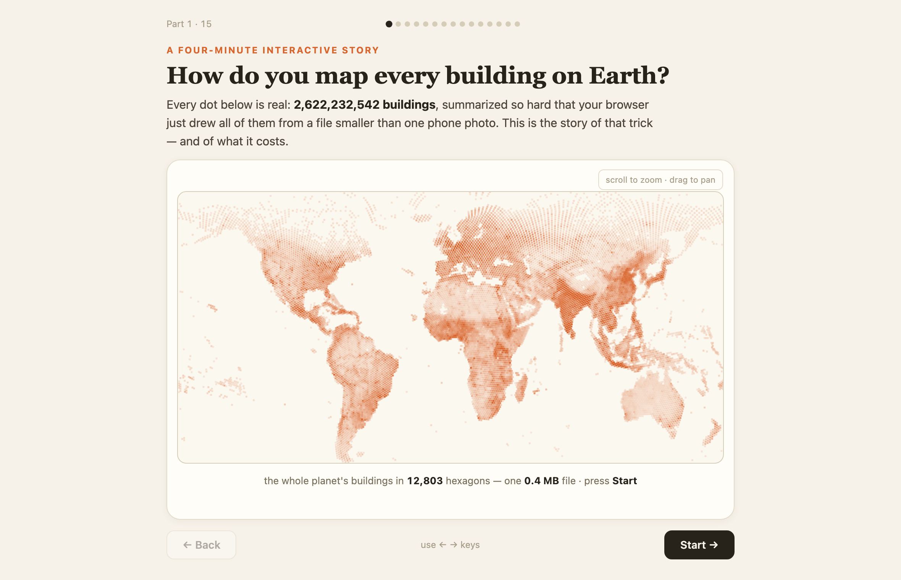

# Buildings → hexagons

An interactive, four-minute scrollytelling explainer: how do you draw all
2.6 billion buildings on Earth in a browser, from a file smaller than one phone
photo?

## What it demonstrates

H3 hexagon aggregation as a data-compression story. The whole planet's building
footprints are summarized into ~13k hexagons (one 0.4 MB file), and the explainer
walks through the trick step by step — with live maps at each stage — plus what
the summarization costs you.

## Run it

Copy this folder into your Fused Render install and open `index.html`. The
`data/` folder ships the pre-computed hex tiles; `h3_ingest.py` shows how they
were built from Overture building footprints.

## Files

| File | Role |
|---|---|
| `index.html` | The step-driven interactive story |
| `h3_ingest.py` | Aggregates Overture buildings into H3 hexes (how `data/` was made) |
| `data/` | Pre-computed hex tiles for several cities + the world |

## Deploying (hosted)

This page can be deployed. Both the client (baked extracts) and `h3_ingest.py`
(live H3 aggregation) load the bundled `data/` files, and both now resolve them
portably: the page uses `fused.rawUrl()` and `h3_ingest.py` uses
`openfused.asset_path("data", …)` when served (a read-only bundle exposes no
`/api/fs/raw` and no writable `data/` path). Local behaviour is unchanged.

Requirements to deploy:

1. **Include the `data/` folder in the bundle.** The files are loaded by computed
   names (e.g. `world_hex${res}_${release}.json`), so the exporter can't
   auto-detect them — add the whole `data/` directory in the Deploy modal's "Will
   publish" list (~17 MB total; within the inline-upload cap).
2. **Bake DuckDB + the H3 community extension into the serve image**, and allow
   outbound HTTPS on first use so DuckDB can fetch the `h3` community extension —
   `h3_ingest.py`'s live-compute steps run on the serve interpreter. Static steps
   that only read the baked extracts work without it.
