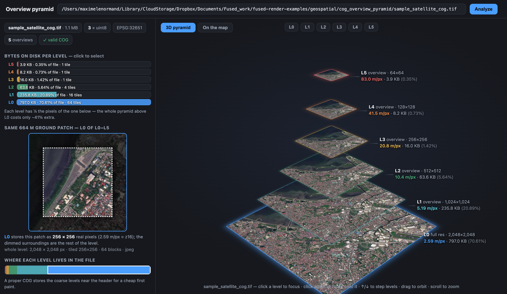

# COG overview pyramid

See every resolution level inside a Cloud-Optimized GeoTIFF as real data —
dimensions, ground resolution, bytes on disk, and a rendered preview of each
level — in an interactive 3D pyramid.

## What it demonstrates

The overview pyramid is what makes COGs fast: each level is ¼ the pixels of the
one below, so a viewer can grab a coarse level for a first paint and only fetch
detail where you zoom. This tool opens any `.tif`/`.tiff`, shows the whole
pyramid stacked in 3D with per-level byte cost and ground resolution, and a
"same ground patch" comparison so you can *see* the detail each level throws
away. If a plain GeoTIFF has no overviews, it can build them (and cogify) in
place.

Ships with a 1.1 MB sample COG (a Maxar Open Data scene of Manila, 6 levels) so
it works the moment you open it; point it at your own `.tif` via the path box.

## Run it

Copy this folder into your Fused Render install and open `index.html`. It
builds a small raster environment (rasterio / rio-cogeo / tifffile) on first run
via [`uv`](https://astral.sh/uv), so make sure `uv` is installed.

## Files

| File | Role |
|---|---|
| `overview_pyramid.py` | Reads a GeoTIFF's levels; analyze / build-overviews / cogify |
| `index.html` | 3D pyramid view, per-level stats, and a map tab |
| `tile_server.py` + `_tiff_core.py` / `tiff_reader.py` / `_raster_common.py` | Bundled tile daemon powering the "On the map" tab |
| `sample_satellite_cog.tif` | 1.1 MB demo COG (Maxar Open Data, Manila) |
