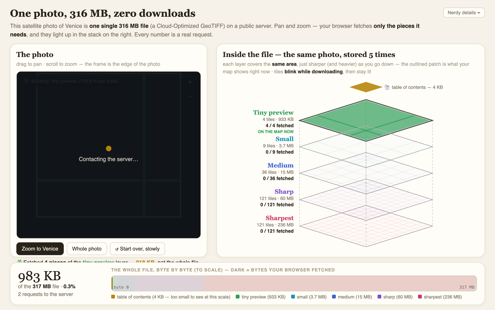

# COG range-request viewer

Stream a multi-gigabyte Cloud-Optimized GeoTIFF into the browser without
downloading it — using nothing but HTTP range requests.

## What it demonstrates

The core trick behind cloud-native raster: a COG's internal tiling + overviews
let a client fetch only the bytes it needs for the current view. A tiny Python
range-proxy serves byte ranges of a remote COG; the page decodes tiles
client-side and shows exactly which byte ranges were requested as you pan and
zoom.

## Run it

Copy this folder into your Fused Render install and open `viewer.html`.

## Files

| File | Role |
|---|---|
| `range_server.py` | Local proxy that forwards HTTP `Range` requests to the remote COG |
| `viewer.html` | Tile viewer that decodes COG tiles and visualizes the range reads |
