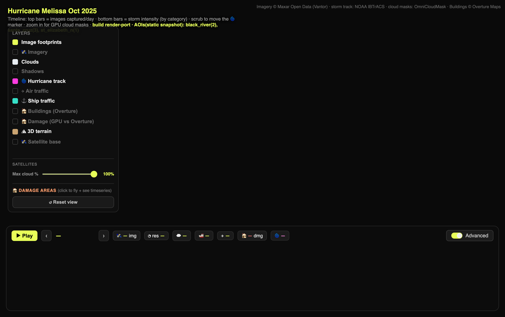

# Disaster response dashboard

Fuse satellite imagery, a storm track, and building footprints for a disaster
event into one map — the kind of rapid situational picture a response team
assembles in the hours after an event.

## What it demonstrates

Multi-layer data fusion over cloud-native sources: high-resolution post-event
imagery (Maxar Open Data), a hurricane track (NOAA IBTrACS), cloud masks, and
Overture building footprints, streamed as tiles/PMTiles and overlaid on one
MapLibre map. Built on the Maxar Open Data program (Hurricane Melissa, Oct 2025).

## Run it

Copy this folder into your Fused Render install and open `index.html`. No
keys required — all sources are public. First load crawls the imagery STAC via a
resumable, budget-bounded poll; then cached.

## Files

| File | Role |
|---|---|
| `disaster_data.py` | STAC crawl + track + AOI fusion, resumable poll protocol |
| `index.html` | MapLibre imagery/track/buildings layers + timeline |
