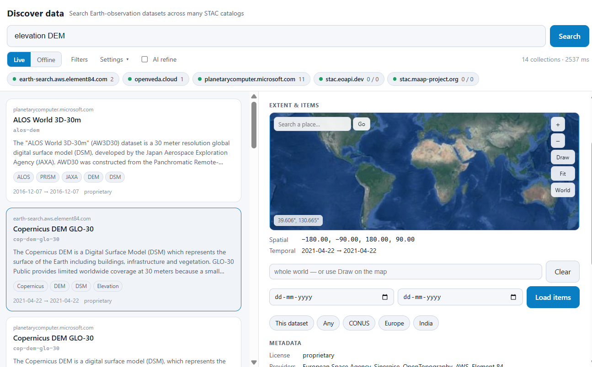

# discover_data

Federated **STAC collection discovery**: type what you're looking for in plain
words and search many public Earth-observation catalogs at once, live. Results
merge into one ranked list; pick a collection and copy a snippet that pulls its
items from the source API.



Two ways to search:

- **⚡ Live** — fan the query out to the configured STAC APIs over HTTP, right now.
- **🗂 Index** — query a **local parquet snapshot** of many catalogs (built once
  from the Index panel, stored under `data/index/`). Instant, offline, spatially
  aware, and the only way to search **static catalogs** that have no search API —
  e.g. [Maxar Open Data](https://stacindex.org/catalogs/maxar-open-data-catalog-ard-format)
  and the ~60 [NASA CMR-STAC](https://cmr.earthdata.nasa.gov/stac) providers.
  Draw a bbox, type "land cover", filter to raster — every matching dataset over
  that region comes back in milliseconds.

Inspired by Development Seed's
[STAC Collection Discovery](https://developmentseed.org/blog/2026-07-30-stac-discovery/)
([API](https://github.com/developmentseed/stac-fastapi-collection-discovery) ·
[web app](https://github.com/developmentseed/stac-collection-discovery)) — the
same stateless, federated idea, reimplemented as a self-contained fused-render
view with the list of catalogs under your control and no service of its own.

## What it demonstrates

- A `fused.runPython` data function that **fans one query out to N STAC APIs in
  parallel** (`concurrent.futures`) and merges the responses — no backend, no
  metadata store, always current against upstream.
- **Per-catalog capability handling:** catalogs that advertise the
  Collection-Search + Free-Text conformance classes get the query pushed down
  server-side (`?q=`); the rest have all their collections fetched and filtered
  locally. If a server-side free-text query errors, it falls back to the local
  path so one flaky catalog doesn't drop out.
- Optional **AI refine** (`fused.ai`, local only): Claude reads the returned
  collections and re-ranks them for your plain-English use case with a one-line
  reason each. Off by default.
- **Self-contained** — no CDN, no map library, no tile server. The interactive
  map is ~200 lines of SVG driven by a vendored vector basemap
  (`vendor/world_map.json`, 116 KB: Natural Earth 50m coastlines and borders,
  polyline-encoded, plus 171 country label anchors). Every bit of view state
  lives in URL params, so any search is refresh-proof and shareable.

## What it does

- **Search box** — free text (`q`). Blank shows a landing page with example
  queries; a query fans out to every configured catalog.
- **Filters** — an optional bounding box (region presets **or draw it on a
  map**, below), a date range via **start / end year dropdowns** (leave End on
  "Latest" for an open-ended interval up to now), and a per-catalog result cap.
  Applied server-side where supported, locally otherwise.
- **Catalogs** — an editable list of STAC API base URLs (defaults below).
  **Validate & Apply** checks each URL is a reachable, collection-searchable
  STAC API (via `validate.py`) before applying, showing a ✓/✗ per URL; a bad
  URL keeps the panel open with an "Apply anyway" override.
- **Results** — one merged, relevance-ranked list of collection cards (title,
  id, source host, description, keywords, temporal span, license) with a live
  per-catalog status strip (count, or a skipped-with-reason chip on failure).
- **Detail panel** — full metadata, an **interactive extent map**, **first-party
  links** (the collection's own JSON, its Items API, and — only when the source
  catalog itself advertises one — its HTML browser; no third-party viewer is
  linked), a **Data section** (below), and a copyable `pystac-client` snippet
  (pre-filled with your bbox/date filters) for actually fetching the items.
- **View the actual data** — load a collection's real items, see their
  footprints on the extent map, open any viewable asset (or several at once) in
  the fused-render **map** template, and download assets to disk. Details below.

## The maps

Both maps are the same pan/zoom component (drag to pan, scroll to zoom at the
cursor, double-click to zoom in, `+`/`−`/`Fit`/`World` buttons, a live lat/lon
readout, and a graticule whose spacing and degree labels follow the zoom).

- **Extent map** (detail panel) — opens *auto-fitted to the collection's
  extent*, which is the whole point: a Maxar event covering half a degree used
  to be an invisible speck on a world rectangle, and now fills the frame with
  country borders and labelled gridlines around it for context. All
  sub-extents are drawn (STAC collections often list many), and your query area
  appears as a dashed box.
- **Draw a bounding box** — pan and zoom to the area first, then drag to draw.
  The box has **eight resize handles**, can be dragged bodily to reposition, and
  its **W/S/E/N are editable number inputs** for exact values. `Pan` (or holding
  Shift) switches dragging back to panning; "Use current view" turns whatever
  you're looking at into the box; region presets jump you to a continent.
- **✨ AI refine** — appears only when running locally with the Claude CLI
  available; toggle on, then "Rank for my use case."

## View the actual data

The detail panel's **Data** section is where a search stops being metadata.
**Load items** fetches the collection's real items — on demand, never
automatically — pre-filtered by the bbox and date range you already set (the
same flow as opengeos' Vantor/Maxar QGIS plugin):

- **`access == "api"`** collections hit the standard
  `/collections/{id}/items` endpoint with `bbox`/`datetime`/`limit`.
- **`access == "static"`** collections (all 55 Maxar Open Data events) are
  crawled: event collection → `rel=child` acquisition collections — each
  carries its own extent, so acquisitions outside your bbox are **pruned
  before their items are fetched** — → `rel=item` item documents, in parallel.
  Asset hrefs in static catalogs are relative (`./…-visual.tif`); every asset
  is resolved to an absolute URL against its item's own URL.

Both paths return **one page of 12 plus a cursor**, and **Load 12 more** resumes
from it. That is what makes the static path usable: a Maxar event fans out to
hundreds of items (433 for Cyclone Ditwah), and fetching all of them to then
keep a dozen cost ~23 s. The crawl now walks acquisitions only until the page is
full, fetches only the item documents it returns, and hands back the rest — a
first page in **1.4–5 s** and later pages in **~0.7 s**. The trade is that
ordering is per page rather than global; a static catalog offers no way to sort
hundreds of items by date without reading every one of them first.

One non-obvious cost lived in the shared `requests.Session`: its default pool
holds 10 connections per host, which every parallel fan-out here overruns, and
an evicted connection costs a fresh TLS handshake (~1.4 s to S3). Raising
`pool_maxsize` cut a first page from 7.3 s to 5.2 s on its own.

Items land in a table (id, date, thumbnail where the item has one, and a chip
per asset) with their **footprints drawn on the extent map** — hovering a row
highlights its footprint and vice versa, and clicking a footprint selects the
row, so you can pick acquisitions spatially.

Every asset the fused-render **map** template can read (COG/GeoTIFF, GeoJSON,
GeoPackage, FlatGeobuf, Shapefile, PMTiles, GeoParquet, …) gets a **map**
button: it opens the map template in a new tab with the asset as a layer and
the camera fitted to the item, via the template's own multi-layer `open=`
format — check several rows and **Open N in Map** stacks them as N layers (the
GeoLibre-extension handoff idea). The fetch happens in a local Python process
rather than the browser, so — unlike browser-side viewers such as GeoLibre —
**no CORS cooperation from the data host is needed**.

### Private storage: signed on click, no account

Every Planetary Computer asset lives in an Azure container that answers an
unsigned GET with `HTTP 409 Public access is not permitted on this storage
account` — so the **map** button did nothing useful for all of PC, the largest
source in the index. PC's SAS API signs any href **anonymously**, so nothing is
ever asked of the user.

Who does the signing has since split in two, deliberately:

- **The map handoff passes the raw href.** The map template grew its own
  `blob_tokens`, which learns from the 409 and *refreshes* the token as it ages.
  Pre-signing here would only pin a token that goes stale while the tab is open,
  so it doesn't.
- **Downloads sign, via `sign.py`.** `download.py` fetches the bytes itself and
  has no token machinery, so it gets a fresh signature at the moment of the click.

Each asset carries an `auth` field (`none`, `azure-sas`, or `""` for an href no
HTTP client can fetch, like the `s3://` URLs VEDA publishes), and an asset that
can't be opened says why on hover instead of silently lacking a button — plus a
**show only assets that open on the map** filter, since a PC item lists ~19
assets of which most are metadata or companions.

No catalog in the default set needs a username or password, so none is asked
for. If one ever does, note that every bit of this page's state lives in URL
params — a credential must never be routed through `fused.params`.

The **↓** button on any http(s) asset streams it to disk (`download.py`,
chunked, reported to the shell's download manager via `fused.trackJob`), then
offers **reveal** and **map** — a downloaded file is a local path, so viewing it
goes through the exact same `open=` handoff. Deliberately plain: no clipping, no
bbox subsetting, no bulk archives.

**Where it lands is yours to set**, once, from **⬇ Downloads…** in the top bar.
Blank means the project's own `data/downloads/`. The choice is a machine
preference, not view state, so it lives in `localStorage` and deliberately **not**
in a URL param — a filesystem path has no business in a link you share.

Paste the path however you happen to have it. `download.clean_dir` strips one
layer of quotes (including smart quotes), unwraps a `file://` URL with its
percent-escapes, expands `~` and environment variables, and normalizes the
separator for the host OS — so Windows' *Copy as path*
(`"C:\Users\you\My Downloads"`, quoted and backslashed) works as pasted. Left
unhandled, each of those becomes a literal directory name instead of the folder
you meant.

Saving is instant because it does that work in the page and validates with
`fused.stat` (8-26 ms), not through a subprocess: an **empty** `main()` measured
5-33 s through the runner, so a runPython call is the wrong tool for one click.
That took Save from ~4.7 s to **0.76 s**. The rules mirror `download.clean_dir`,
which is safe because `download.py` re-cleans whatever it is handed -- a drift
could only change what the dialog *displays*, never where a file lands, and a
test pins the two together across every paste form. Environment variables are the
one thing a page cannot expand, so `%USERPROFILE%`-style paths still go to
`resolve_dir.py`. A path that is a file, or has no writable ancestor, is refused
in the dialog rather than at download time.

**Browse…** asks the OS for its own folder chooser, and falls back to an in-page
file browser when that fails: shortcut buttons (Home, Downloads, Fused, the
drive root), a **breadcrumb whose every segment is clickable** so any ancestor is
one click away, an `..` row, and the listing itself — folders to click into, files
shown muted, because a listing of nothing but sub-folders gives you no way to
recognise where you are. Browsing *is* choosing: the field tracks the folder on
screen and **Save** takes it.

The fallback is silent by design. It used to announce "the system folder chooser
is unavailable", which read like something had gone wrong when in fact the button
had just done its job the other way.

It fires on Windows in the current fused-render build every time:
`POST /api/fs/pick-folder` raises `AttributeError: module
'win32com.shell.shell' has no attribute 'CLSID_FileOpenDialog'` and 500s in 0 ms
without showing a dialog, even though `/api/config` advertises
`native_dir_picker: true`. Another upstream bug; the fallback means Browse works
regardless of it.

**Remote rasters: mostly fixed upstream, one holdout.** This used to be a flat
"remote rasters never paint" -- every remote COG returned a good descriptor and
then timed out on its first tile, and one attempt wedged the map daemon so even
local rasters stopped serving. The daemon now bypasses its in-process range relay
for clean and signed object URLs, and re-measured on a freshly started daemon:

| target | first tile |
|---|---|
| local GeoTIFF | `HTTP 200`, 4 KB PNG, **0.05 s** |
| Planetary Computer COG (unsigned, template signs it) | `HTTP 200`, 41 KB PNG, **0.79 s** |
| Maxar ARD `-visual.tif` | `HTTP 200`, **1.42 s** |
| Sentinel-2 from `sentinel-cogs.s3.us-west-2` | **still times out** |

So Maxar works, Planetary Computer works, and a failed source no longer takes the
daemon down with it -- a local tile still served in 0.05 s straight afterwards.

The element84 Sentinel-2 COGs are the holdout, and it is not size, reach or
bandwidth: 5 MB and 235 MB assets both time out, `curl -r` on the same URL
returns `206`, and 4 MB pulls measure ~1.2 MB/s against Maxar's ~1.0 MB/s. Still
an upstream matter. For anything that will not stream, **the direct asset link and
the download button both work** -- a downloaded file is a local path, and local
files, so the data is never out of reach.

## How the Python is wired

The page calls `fused.runPython("./discover.py", {q, bbox, datetime, limit,
apis})`. `main()` returns a normalized shape:

```
{ q, place, bbox_used, total, elapsed_ms,
  collections: [ {id, title, description, keywords, license, providers,
                  bbox, bboxes, temporal, api, api_host, access, items_href,
                  self_href, score, text_score, server_matched}, ... ],
  sources:     [ {base, host, ok, supports_q, returned, number_matched, error?}, ... ] }
```

`query_index.py` returns the same shape (plus `built` and `indexed`, and a
`kind` per collection), so the page renders both modes with one code path.

Every collection is scored locally so the merged list has one consistent order
regardless of which catalog or code path produced it. Scoring is
**word-boundary** (the query "land" no longer matches "Fin**land**"), drops
stopwords ("dataset", "for", …), and weights title/id (3) > keywords (2) >
description (1) = **provenance** (1), with a phrase bonus.

Provenance matters more than it sounds: many collections never name their own
provider — every Maxar Open Data collection is titled after the disaster
("Bay of Bengal Cyclone Mocha 2023"), with empty keywords and no providers, so
a search for "maxar" matched *none* of them. Each row therefore carries a
`source_terms` field built from its catalog's URL and root title (infrastructure
words like `s3`, `amazonaws`, `com` stripped), scored at the weakest weight — so
"maxar" now returns all 55 events, while collections that genuinely say MAXAR in
their title still rank above them.

Scoring also understands **places**: "land cover for india" resolves
"india" against the vendored gazetteer (`vendor/places.json`, ~240 countries and
regions) into a bounding box that filters results *and* boosts collections whose
extent actually fits the region — a regional land-cover product outranks an
equal-text global one. The detected place is shown as a 📍 chip; an explicit
bbox in Filters always wins.

## The local index (parquet, not CSV)

The Index panel harvests collection metadata into parquet part-files under
`data/index/parts/` (one or more per source) — the same idea as opengeos'
[maxar-open-data](https://github.com/opengeos/maxar-open-data) /
[NASA-CMR-STAC](https://github.com/opengeos/NASA-CMR-STAC) /
[stac-index-catalogs](https://github.com/opengeos/stac-index-catalogs) CSV/TSV
lists, but stored as typed parquet so `query_index.py` can run real predicates
(bbox intersection, raster/vector, token prefilter) with duckdb instead of
string-parsing a CSV. Source specs, one per line:

```
https://host/stac                        a STAC API (paginated /collections)
static:https://…/catalog.json            a static catalog, crawled via rel=child
cmr:https://cmr.earthdata.nasa.gov/stac  NASA CMR-STAC (expands all providers)
…|kind=raster                            hint when the classifier can't decide
```

Builds are **chunked and resumable**: each `build_index.py` call works for at
most ~35 s and returns a cursor, so the 60 s runPython limit never hits, and a
huge source (CMR is thousands of collections) just takes several calls — the
panel loops them with live progress and a Stop button. Each collection row is
classified **raster / vector / unknown** from its asset media types (wording as
fallback), which powers the Raster/Vector chips in Index mode. More catalogs to
index can be found at [stacindex.org](https://stacindex.org/catalogs).

## Default catalogs

`https://planetarycomputer.microsoft.com/api/stac/v1` ·
`https://earth-search.aws.element84.com/v1` · `https://stac.maap-project.org` ·
`https://stac.eoapi.dev` · `https://openveda.cloud/api/stac`

Planetary Computer and Earth Search ignore `q`, so they're fetched and filtered
locally; MAAP, eoAPI, and VEDA are queried server-side. Replace the list from
the **Catalogs** panel to point at your own deployments.

## Run it

Copy this folder into your Fused Render install and open `index.html`.
Everything is stdlib + `requests`; no extra install. AI refine additionally
needs a Fused Render build with `fused.ai` and the Claude CLI installed and
authenticated locally — it's a local-only feature (a page that calls `fused.ai`
is rejected by the hosted-export path).

## Tests

The Python side is covered by pytest (HTTP fully mocked; the index tests write
parquet to a tmp dir):

```
uv run --with pytest --with requests --with pyarrow --with duckdb pytest -q
```

This includes codec tests: metadata is full of `→`, `°`, and non-Latin scripts,
and Windows consoles default to cp1252 — all entrypoints force UTF-8 stdio
(`discover._utf8_stdio`) and every text file is read/written as UTF-8, so no
`'charmap' codec` errors.

## Files

| File | Role |
|---|---|
| `index.html` | the whole UI — search, Live/Index modes, the interactive map component (extent view + draw-a-box), filters, catalog list + validation, index builder, result cards, detail panel, code hints, AI refine |
| `discover.py` | `runPython` entrypoint: parallel federated collection search across the catalogs, capability detection, query understanding (stopwords, places), local scoring |
| `build_index.py` | `runPython` entrypoint: resumable harvest of one source (API / static catalog / CMR) into parquet parts |
| `query_index.py` | `runPython` entrypoint: duckdb search over the local index — bbox, kind, tokens — ranked by the same scorer |
| `index_store.py` | shared index plumbing: parquet schema, parts/meta IO, raster-vs-vector classification |
| `items.py` | `runPython` entrypoint: items for one collection with assets resolved to absolute URLs — API fetch or static-catalog crawl, driven by `access` |
| `resolve_dir.py` | `runPython` entrypoint: expands the one thing the page cannot -- environment variables in a pasted download folder |
| `sign.py` | `runPython` entrypoint: signs a download's href when it sits in private storage (Planetary Computer's anonymous Azure SAS); classifies what each href needs |
| `download.py` | `runPython` entrypoint: stream one asset to the chosen download folder; owns path normalization (`clean_dir`) and safe, non-colliding filenames |
| `validate.py` | `runPython` entrypoint: checks each catalog URL is a reachable, collection-searchable STAC API |
| `test_discover.py`, `test_index.py`, `test_items.py`, `test_validate.py` | pytest suites (mocked HTTP) |
| `vendor/world_map.json` | vector basemap for the interactive maps — 50m coastlines/borders (polyline-encoded) + country label anchors |
| `vendor/places.json` | place-name → bbox gazetteer (Natural Earth 110m countries + regions) |
| `icon.svg` | project icon |
