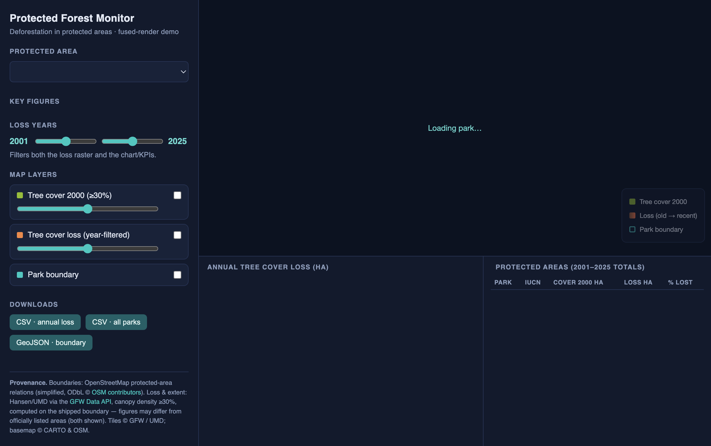

# Protected forest monitor

Track deforestation inside protected areas: pick a national park, see its annual
tree-cover loss, cumulative loss, and the share of its year-2000 canopy that's
gone.

## What it demonstrates

On-the-fly zonal statistics against a live raster API: park boundaries
(OpenStreetMap protected-area relations, shipped as GeoJSON) are sent to the
Global Forest Watch Data API to compute Hansen/UMD tree-cover loss per year.
Loss and tree-cover rasters are also streamed as map tiles, recolored
client-side by year.

## Run it

Copy this folder into your Fused Render install and open `index.html`. No
keys required (GFW's public frontend key is embedded). First load fetches zonal
stats for six parks via a detached warmer; then cached.

## Files

| File | Role |
|---|---|
| `forest.py` | GFW zonal queries per boundary + warm-up daemon |
| `index.html` | MapLibre loss/cover tiles + KPIs + annual-loss chart |
| `boundaries/` | Six park boundaries (OSM, simplified GeoJSON) |
