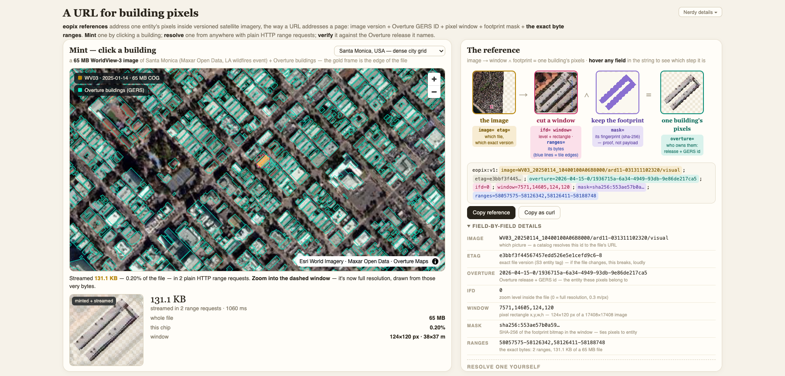

# eopix — a URL for building pixels

Mint and resolve **eopix references**: compact strings that address one
building's pixels inside a versioned satellite image, the way a URL addresses
a page — image version + Overture GERS ID + pixel window + footprint-mask hash
+ **the exact byte ranges**. Anyone holding the string streams just those
pixels (~100 KB out of a 65 MB scene) with plain HTTP range requests, and can
verify they still belong to that building.

**[▶ Try it live](https://open.fused.io/kmubo2djxutwzc3tuyf3kfvs2y)** — no install needed.



## What it demonstrates

- **Entity-anchored imagery referencing** — Overture GERS ↔ pixels, the
  "eopix" idea from the Overture conflation conversation, working end to end:
  click a building to mint a reference, paste any reference to resolve it,
  tampered references fail loudly (etag / mask-hash badges).
- **COG internals, honestly** — byte ranges come straight from the file's tile
  offset tables; tiles decode in the browser from exactly the ranged bytes via
  the abbreviated-JPEG trick (`JPEGTables[:-2] + tile[2:]`). Every byte number
  on the page is a real request.
- **Mask as proof, not payload** — the reference carries a SHA-256 of the
  footprint bitmap; the resolver re-derives the footprint from the Overture
  release named in the reference and checks the hash.
- **Three building fabrics** in a dropdown (Santa Monica grid, small-town
  Texas, dense Cebu City), all real Maxar Open Data COGs. A reference pasted
  on the wrong site hops to the right one — the string is self-sufficient.

## Run it

Copy this folder into your Fused Render install and open `index.html`.

Or resolve a reference with no browser at all — the point of the format:

```bash
python3 resolve.py 'eopix:v1:image=...;window=...;ranges=...'
# writes chip_<gers>.png after 2-3 HTTP range requests
```

## Files

| File | Role |
|---|---|
| `index.html` | Map + reference builder: mint on click, resolve on paste, verify against Overture |
| `resolve.py` | Standalone resolver (stdlib + Pillow): reference string → building chip PNG |
