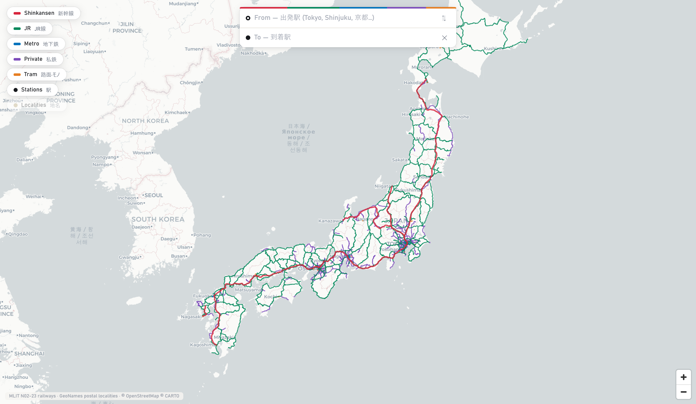

# japan_transit

A travel dashboard for Japan: the whole national rail network on a fast dark
map, with Google-Maps-style station-to-station routing.

## What it demonstrates

GPU-ready columnar binaries instead of GeoJSON/PMTiles for a big vector
layer, and a Dijkstra router running per-query in Python behind
`fused.runPython` — see "Why columnar binary" below.

## What it does

- **Full-Japan rail map** — 21,949 track segments drawn with deck.gl, colored
  by category: Shinkansen / JR / Metro & subway / private rail / trams &
  monorails. Every layer is toggleable; panels collapse so the map stays the
  hero.
- **10,240 stations** with bilingual names (Japanese + romaji) and instant
  client-side search (vowel-insensitive: "Tokyo" matches "Toukyou").
- **Routing** — pick two stations (search or click on the map) and get up to
  three route options with legs, transfers, and approximate times, drawn on
  the map and as a door-strip style itinerary. Switch options with ‹ › (or
  ←/→ keys), or click a gray ghost line on the map. Alternatives come from
  re-running Dijkstra with the fastest route's lines penalized, plus a
  no-Shinkansen run; anything slower than 1.6× the best is dropped. Times are
  estimates from track distance and per-category average speeds (they are
  *not* timetable data — treat them as planning approximations).
- **Reach map** — one-click isochrone: color every station in Japan by
  approximate travel time from a chosen origin.
- **68,096 localities** from GeoNames as an ambient density layer.

## Run it

Copy this folder into your Fused Render install and open `index.html`. All
data is local; the basemap uses CARTO light tiles (needs network).

## Data

| File | Source | Notes |
|---|---|---|
| `data/rail.bin` + `rail_meta.json`, `data/stations.json` | [MLIT N02-23 railway data](https://nlftp.mlit.go.jp/ksj/gml/datalist/KsjTmplt-N02-2023.html) (国土数値情報 鉄道) | CC-BY-4.0-compatible government data, FY2023 edition |
| `data/postal.bin` + `postal_pref.bin` | [GeoNames postal codes JP](https://download.geonames.org/export/zip/) | CC-BY 4.0 |
| `data/graph.json` | derived | ride edges from track geometry (Voronoi labeling along the line graph), transfer edges from N02 station-group codes + <300 m walking pairs |

Rebuild everything with `scripts/build_data.py <dir with JP/ and N02/UTF-8/ downloads>`
(needs `pykakasi` for romaji).

## Routing model

Nodes are (station × line) pairs. Ride edges connect track-adjacent stations
on the same line; time = distance / category speed + dwell (Shinkansen
150 km/h … tram 20 km/h). Transfer edges: 5 min within a station complex
(same N02 group code), 8 min for <300 m walks between complexes. `route.py`
runs Dijkstra per query (~0.1 s) and merges consecutive same-line hops into
legs. No timetables, no fares, no buses — approximate by design.

## Why columnar binary instead of GeoJSON / PMTiles

The heavy layers ship as GPU-ready columnar binaries (the layout GeoParquet /
Arrow use internally): `rail.bin` packs Float32 positions + Uint32 path
offsets + Uint16 name indices per category, `postal.bin` packs Float32
lon/lat pairs. The browser does `fetch → typed-array view → deck.gl` with zero
parsing — replacing an 11.7 MB GeoJSON (parse + per-feature transform each
load) with a 3.4 MB buffer. Vector tiles (PMTiles/MVT) would add tile decode,
zoom pop-in, and a tippecanoe build step without gain at this scale (~400k
vertices fits on the GPU whole); they pay off when the data is far larger than
the viewport or served remotely.

## Files

| File | Role |
|---|---|
| `index.html` | the map, search, routing UI, and deck.gl rendering |
| `route.py` | Dijkstra router, called via `fused.runPython` |
| `data/` | baked rail/station/postal binaries + the routing graph |
| `vendor/` | vendored d3, deck.gl, maplibre-gl |
| `scripts/build_data.py` | rebuilds everything in `data/` from source downloads |
