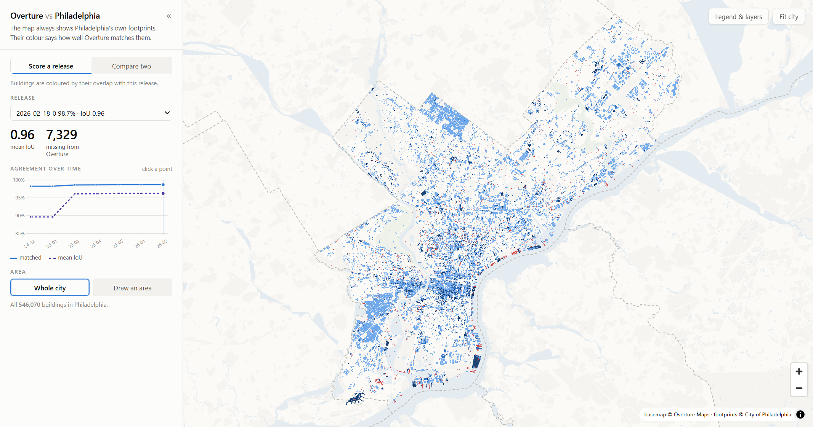

# Overture footprint scorecard

Score **Overture Maps building footprints** against a city's official building
layer, every building, across eight Overture releases — entirely on your
machine.

The reference example is Philadelphia: the city's `LI_BUILDING_FOOTPRINTS`
layer is treated as ground truth, and each of its **546,076** buildings gets an
**IoU** score (shared area ÷ combined area) against its best-overlapping
Overture footprint — 1.0 is an exact match, 0 means Overture has no building
there. Comparing those scores across releases turns the map into an evaluation
framework for how Overture's data has changed over time.

## What it demonstrates

The "build once, then explore instantly" pattern: a long local build produces
static artifacts (PMTiles + Parquet), and the browser does the rest with zero
Python calls per interaction.

- **DuckDB does the conflation** — its native multithreaded `SPATIAL_JOIN`
  computes every candidate intersection across all cores, with areas measured
  in EPSG:2272 (PA South) rather than in degrees.
- **PMTiles baked in Python** — DuckDB's `ST_AsMVT` plus a small PMTiles v3
  writer (`pmtiles_writer.py`) produce one archive for the city scorecard and
  one per release for Overture's own geometry. `/api/fs/raw` serves HTTP ranges
  for the pmtiles JS protocol, so there is no tile server.
- **Release switching is a pure client-side restyle** — every building carries
  all eight scores (`i0…i7`) as tile attributes, so changing the release
  repaints without refetching a single tile.
- **The basemap is Overture's own published vector tiles**, read remotely over
  HTTP range requests — no raster basemap, and thematically apt.
- **Hover uses `feature-state`, not `setFilter`** — a paint expression reads
  `["feature-state","hover"]` and each move is coalesced into one
  `requestAnimationFrame`, so highlighting a 546k-feature tileset stays instant.

## Run it

Open `index.html` in Fused Render. The first run shows a build screen that,
once, downloads both datasets and runs the conflation locally:

- downloads the city footprints (bulk GeoJSON from ArcGIS Hub)
- pulls each release's buildings for the city bbox from **Fused's Overture
  mirror** on source.coop (the official Overture bucket only retains the two
  most recent releases, so the historical ones live only there)
- scores every city building against every release in DuckDB
- bakes the result into PMTiles

Budget about **2 GB of disk** and **50–70 minutes**, once — most of it
downloading ~1.2 GB of Overture geometry. Everything is cached under `.cache/`
and each stage is skipped if already present, so an interrupted build resumes.
Delete `.cache/` to start over. After the build the app is instant and offline.

## The viewer

The map always draws the same thing — the city's own footprints. Only their
colour changes, and two modes decide what the colour means:

- **Score a release** — each building is coloured by its IoU with the chosen
  release (close / partial / poor / not in Overture). Pick the release from the
  dropdown or by clicking a point on the trend chart.
- **Compare two** — pick any two releases and each building is coloured by how
  its overlap *changed*: newly found, improved, unchanged, worse, disappeared.

Around that:

- **Controls panel (left)** — mode, release pickers, KPIs, the agreement-over-
  time chart, and the area scope. Collapse it with the `«` button to give the
  map the full window; a **Controls** button brings it back.
- **Legend & layers (top-right)** — starts collapsed so the map opens
  unobstructed; the **Legend & layers** button reveals per-class counts and
  shares (click a class to hide it), the **Show only mismatches** shortcut, and
  the layer toggles for the city and Overture footprints.
- **Draw an area** — drag a box to re-score just that area (a DuckDB aggregate,
  well under a second).
- **Click a building** for its address, size, and a line chart of its IoU
  across all eight releases (bottom-right).

## Files

| File | Role |
|---|---|
| `index.html` | the app — MapLibre + PMTiles + d3, all vendored under `vendor/` |
| `prepare.py` | build orchestrator + detached worker; `main(action="status"/"start")` |
| `tiler.py` | DuckDB `ST_AsMVT` → PMTiles archives |
| `pmtiles_writer.py` | minimal clustered PMTiles v3 writer |
| `stats.py` | runPython endpoints: drawn-area stats + per-building detail |
| `common.py` | releases, city bbox, cache paths, DuckDB connections |
| `vendor/` | maplibre-gl, pmtiles, d3 |
| `slides/index.html` | a five-slide talk on what the scorecard found — open it on its own |
| `.cache/` | (generated) parquet, summaries, `*.pmtiles` — gitignored |

## Adapting it to another city

`common.py` holds everything city-specific: `PHILLY_BOUNDS`,
`PHILLY_GEOJSON_URL`, and the `RELEASES` list. Point those at another city's
footprint download and bounding box, delete `.cache/`, and rebuild.
