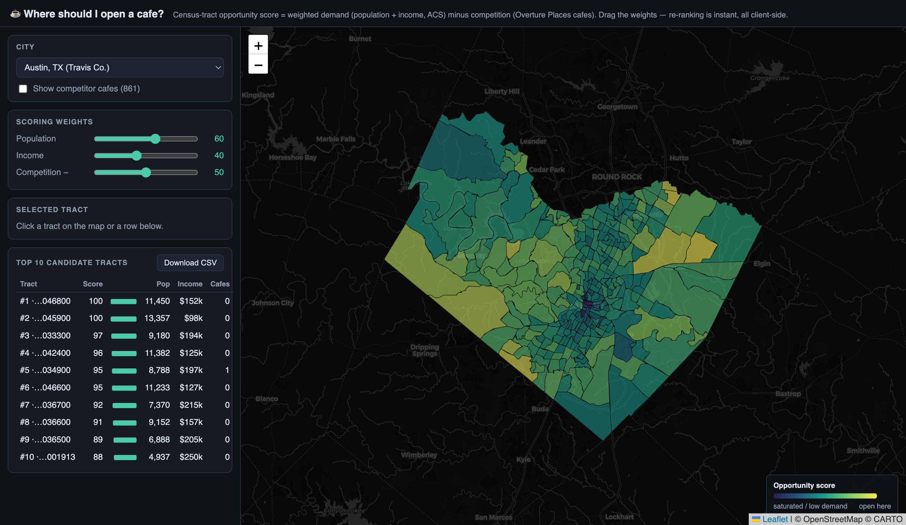

# Store site selection

"Where should I open a cafe?" — score Census tracts in a city by population,
income, and distance to existing competitors, with weight sliders that re-rank
instantly.

## What it demonstrates

A classic site-selection workflow built from open data: Census tracts + ACS
demographics (keyless Census APIs) and competitor POIs (Overture Places on S3
via DuckDB). Scoring runs in the browser so the weight sliders re-rank with zero
Python round-trips.

## Run it

Copy this folder into your Fused Render install and open `index.html`. Needs
a free `CENSUS_API_KEY` — copy `.env.example` to `.env`
([get one here](https://api.census.gov/data/key_signup.html)). First load per
city fetches the data via a detached warmer; then it's cached.

## Files

| File | Role |
|---|---|
| `site_data.py` | Tracts + demographics + competitor POIs + warm-up daemon |
| `index.html` | Choropleth + weighted scoring UI |
