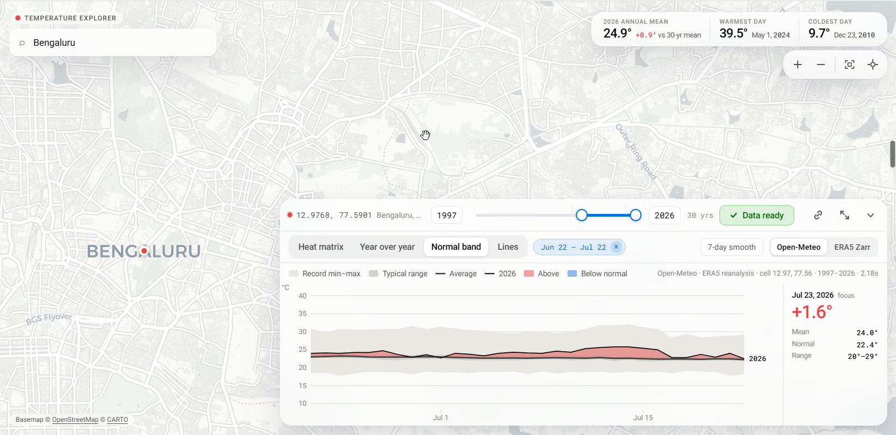

# temperature_explorer

A sleek, single-screen explorer for the historical daily temperature of any
one point on Earth, read live from a free, no-login source. Search a place
(or click the map) to drop a point, pick a year range, press Run, and get a D3
chart you can slice by year, date, and week.

## What it demonstrates

A whole interactive climate view — map, geocode, four chart modes, URL-synced
state — driven by a single stdlib-only `runPython` call against a free REST API,
with no dependencies to install.

## What it does

- **Pick a point** — search (OpenStreetMap Nominatim, no key) or click/drag
  the marker on the map.
- **Deep history, instantly** — daily max/min/mean from
  [Open-Meteo](https://open-meteo.com/)'s ERA5 archive (point-optimized,
  ~0.25°/9 km, 1940→present), back in ~1–2 s. A provenance line shows the exact
  grid cell, coverage dates, and fetch time.
- **Four chart modes** — a heat matrix of daily anomalies, "Compare years"
  (every selected year on the same Jan→Dec axis), a "Normal band" of each
  year's deviation from the mean, and overlaid "Lines".
- **The year rail** below the chart doubles as legend, year selector (up to
  8 at once), and a live min/mean/max readout for whichever day is under the
  cursor.
- **Hover for a crosshair**, **click to pin** a date (arrow keys step it,
  Shift for ±7 days), toggle **7-day smooth** for a rolling weekly mean.
- **Zoom** into a date range with a video-trim-style bar (vendored
  [noUiSlider](https://refreshless.com/nouislider/), MIT).
- **Spotlight a year** by clicking its swatch in the rail; every other line
  dims. Years are told apart by color plus a fixed stroke pattern/marker
  pair, so they're distinguishable even in grayscale.

## How the Python is wired

The page calls `fused.runPython("./fetch_temps.py", {lat, lon, start_year,
end_year})`. `main()` makes one Open-Meteo REST call and returns a normalized
shape (`{source, start, end, time[], tmax[], tmin[], tmean[]}`) in ~1–2 s.

## Dependencies

None — `fetch_temps.py` is standard-library only (`urllib`), so it runs on
fused-render's bundled Python with no install step.

## Run it

Copy this folder into your Fused Render install and open `index.html`.

## Files

| File | Role |
|---|---|
| `index.html` | the whole UI — map, search, controls, D3 charts, provenance |
| `fetch_temps.py` | `runPython` entrypoint: one Open-Meteo REST call, stdlib only |
| `vendor/` | `d3.min.js`, `maplibre-gl.{js,css}`, `nouislider.min.{js,css}`, Roboto woff2 + `roboto.css` |

## Notes & limits

- Open-Meteo's archive lags real time by ~5 days, so the current year is
  partial.
- Nominatim search follows OSM's usage policy (debounced, ≤1 req/keystroke-pause).
