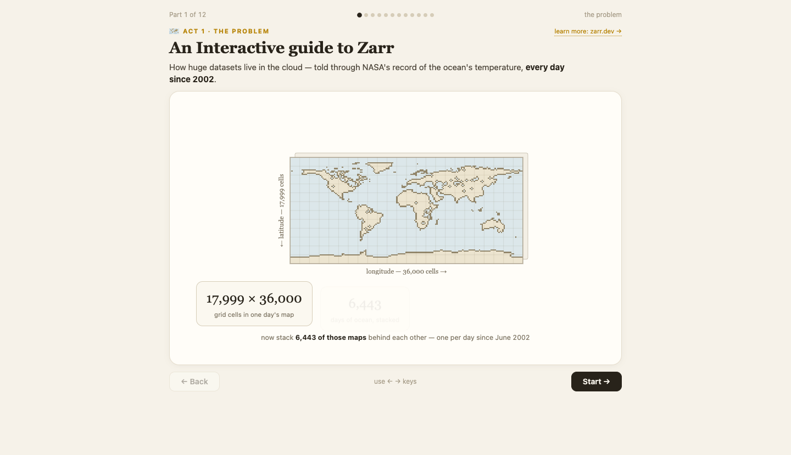

# An Interactive guide to Zarr

A 12-step visual explainer of the Zarr format for someone with zero geospatial
background — told through NASA's MUR sea-surface-temperature record. Chunking,
computable chunk names, stores-as-folders, reads, sharding, and where Zarr sits
among the formats, each as a hands-on interactive stage.

## What it demonstrates

- The cloud-native core idea: cut an N-d array into chunk files whose **names
  are their positions**, so a reader fetches only what it needs — no index, no
  byte math.
- Every default interaction runs instantly against `mock_store/` — a real-data
  (ERA5-resampled) scaled-down twin of `s3://mur-sst/zarr-v1` (zarr v3,
  12×360×720, 1×90×180 chunks). One explicit opt-in step reads a real 13 MB
  chunk from NASA's S3 with a live byte counter — the wait is the lesson.
- A session "data receipt": every chunk you pulled glows inside a ghost
  datacube.
- `pixel_icons/` — the dithered pixel-art icon library used across the page
  (inlined into the html; `preview.html` is the gallery).

## Run it

Copy this folder into your Fused Render install and open `explainer.html`.
Deep-link any step with `?step=0..11`.

## Files

- `explainer.html` — the whole story + playground (self-contained; icons inlined)
- `zarr_probe.py` — daemon backend: /tree /slice /probe /stats /ls /clearcache,
  spawns a uv venv (zarr ≥ 3, s3fs) and meters every store request
- `mock_store/mur_sst_mini.zarr` — the local mini twin (real 2022 SST, 200 files)
- `pixel_icons/` — icon library + gallery
- `PORT_NOTES.md` — design/decision log (rev history)
