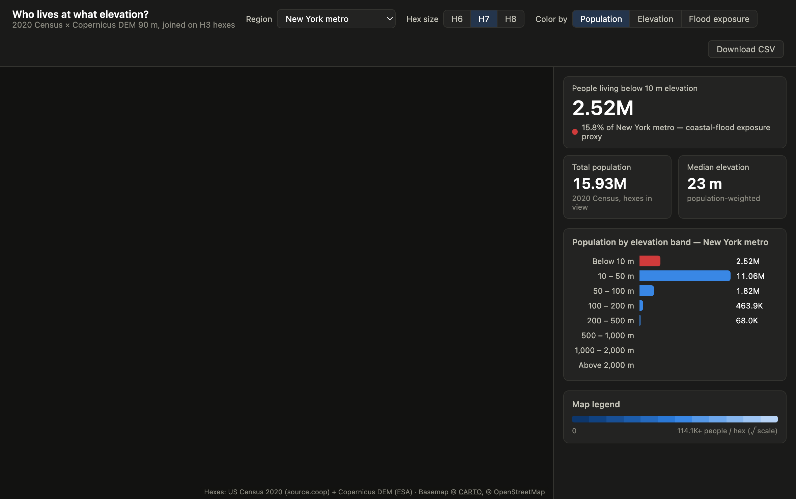

# Who lives at what elevation?

Joins the 2020 US Census population grid with the Copernicus DEM, on H3 hexes,
to answer: how many people in a metro live below 10 m — a coastal-flood
exposure proxy.

## What it demonstrates

Zonal statistics on cloud-native hex data with zero local preprocessing: two
public Parquet datasets (Census on source.coop, Copernicus DEM on S3) are joined
entirely inside DuckDB via H3 bit-math range predicates, then aggregated to any
resolution client-side. Switch region, hex size, or color mode instantly.

## Run it

Copy this folder into your Fused Render install and open `index.html`. First
load of a region fetches the two datasets (a detached warmer keeps it under the
runtime's time limit); subsequent loads are instant from cache.

## Files

| File | Role |
|---|---|
| `zonal.py` | DuckDB join + H3 aggregation + resumable warm-up daemon |
| `index.html` | deck.gl hex map, KPIs, elevation-band chart |

## Deploying (hosted)

This page can be deployed. Hosted there is no local filesystem and per-call
subprocess isolation, so the background warm-up daemon can't work (its `./.cache`
wouldn't survive to the next call). `zonal.py` detects the hosted runtime (the
`openfused` shim is present only when served) and **skips the daemon**, running
the population/elevation fetch inline in a single, longer call. Local behaviour
is unchanged.

Requirement: **allow outbound HTTPS** to the two public Parquet sources
(`*.source.coop`, the `fused-asset` S3 bucket) via DuckDB `httpfs`. No secrets.
Confirm the per-call timeout accommodates the cold fetch (60–90 s locally).
