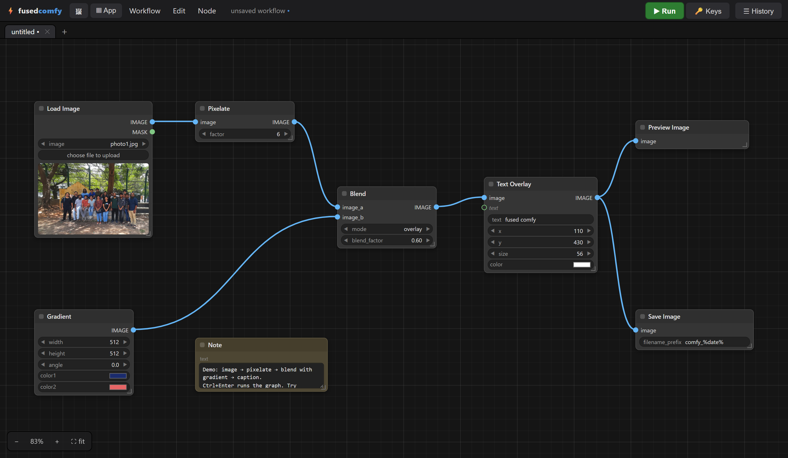

# comfy

A ComfyUI-style node editor as a Fused Render view — a node-graph editor in the
spirit of ComfyUI, with a local PIL-backed execution engine.

## What it demonstrates

A full desktop-class app (infinite canvas, undo/redo, drag-drop, tabs) built
entirely as one HTML view plus two Python entrypoints, with every node
execution round-tripping through `fused.runPython`.

## What works

- **Canvas** — infinite pan (right/middle-drag, space+drag) and wheel-zoom,
  box-select, shift-click multi-select, grid background, fit view (`F`).
- **Nodes** — ~45 image node types (load/generate/adjust/filter/transform/
  composite/draw/mask/channels/primitives/output — including levels, auto
  contrast, equalize, solarize, sepia, color balance, tint, vignette, emboss,
  median, film grain, borders, channel split/merge), typed ports with ComfyUI's
  port colors, widgets (scrub-or-type numbers, combos, toggles, color pickers,
  seed with fixed/randomize/increment control, multiline text), collapse,
  resize, rename, title colors, mute (`Ctrl+M`), bypass (`Ctrl+B`), Reroute and
  Note nodes, groups.
- **Editing** — undo/redo, copy/paste/duplicate, delete, right-click context
  menus, double-click node search palette; dragging a link onto empty canvas
  opens the palette filtered to compatible nodes and auto-connects.
- **Connections** — bezier links colored by type, type-checked on connect, one
  link per input, cycle rejection, drag-off-input to detach.
- **Execution** — Run (`Ctrl+Enter`) topologically sorts to the output nodes,
  runs one `engine.py` subprocess per node via `fused.runPython`, highlights
  the running node, shows a progress bar, caches by content signature (second
  run of an unchanged graph executes nothing), surfaces errors on the failing
  node, supports cancel between nodes.
- **Tabs** — multiple workflows open at once in a browser-style tab strip.
  *New tab* (or the `+`) opens a blank canvas without disturbing the others;
  *Open / Import…* and demos open in their own tab; click to switch, ✕ or
  middle-click to close. The whole tab session is autosaved and restored on
  refresh.
- **Workflow I/O** — the native serialization *is* ComfyUI's workflow JSON
  schema. *Workflow ▸ Open / Import…* lists saved workflows under `workflows/`
  and merges in JSON/PNG import; export/download; both ComfyUI workflow JSON
  **and** API-format JSON import (`workflows/comfyui_import_demo.json` is a
  real SDXL graph — unknown node types render as editable "ghost" nodes and
  round-trip on re-export). `SaveImage` embeds the workflow in the output
  PNG's `tEXt` chunk; drag any such PNG back onto the canvas to restore the
  graph (as a new tab).
- **Local ML on CPU** — `Depth Estimation` runs Depth-Anything-V2-small
  (quantized ONNX, ~27 MB, auto-downloaded to `.models/` on first use) in
  about a second per image on CPU via onnxruntime. `Image → Point Cloud` turns
  image + depth into a colored point cloud, and `Preview 3D` renders it with a
  dependency-free WebGL orbit viewer (drag to rotate, wheel to zoom,
  double-click for fullscreen). Workflow ▸ *Load 3D demo*.
- **Hosted models via API keys** — each hosted node has an `api_key` field you
  can paste the key straight into; leave it blank to fall back to the 🔑 Keys
  dialog. Nodes: `HF Text to Image` (FLUX.1-schnell / SDXL via the Hugging
  Face Inference API, needs `HF_TOKEN`), `HF Image Caption` (BLIP), and
  `Seedance Text to Video` (BytePlus ModelArk, needs `ARK_API_KEY`; generation
  takes minutes, so the node submits once and each re-run resumes polling the
  same task). Workflow ▸ *Load API demo*.
- **App mode** — the ▦ App button (or `?mode=app`) hides the graph and shows a
  clean form: source-node widgets on top, Run, output previews below — like
  ComfyUI's app view. Right-click any node → *Show in App mode* to hand-pick
  exactly which cards appear.
- **Assets gallery** — the 🖼 button opens a collapsible sidebar with every
  asset any run has generated (recorded in `comfy.db` together with the exact
  workflow that produced it). Click to zoom, **⤓ save** copies a cached
  preview into `output/`, **↺ load** restores that asset's workflow onto the
  canvas.
- **History** — every action (save, open, import, export, run, node error,
  upload) is logged to `comfy.db` (SQLite); the History button shows the log.

## Run it

Copy this folder into your Fused Render install and open `comfy.html`.

Hosted-model nodes are optional — the editor and all local image nodes work
fully offline. To use `HF Text to Image` / `HF Image Caption` or `Seedance
Text to Video`, either paste a key into the node's `api_key` field, or set the
matching environment variable (see `.env.example`).

## Files

| File | Role |
|---|---|
| `comfy.html` | the whole editor (DOM-free graph core + UI layer) |
| `engine.py` | executes one node per call (PIL/numpy), disk cache in `.cache/` |
| `api.py` | setup, uploads, workflow listing, PNG metadata, SQLite event log |
| `workflows/` | saved workflows, including the ComfyUI import and API demos |
| `input/photo1.jpg` | sample photo used by `background_removal_demo.json` |
