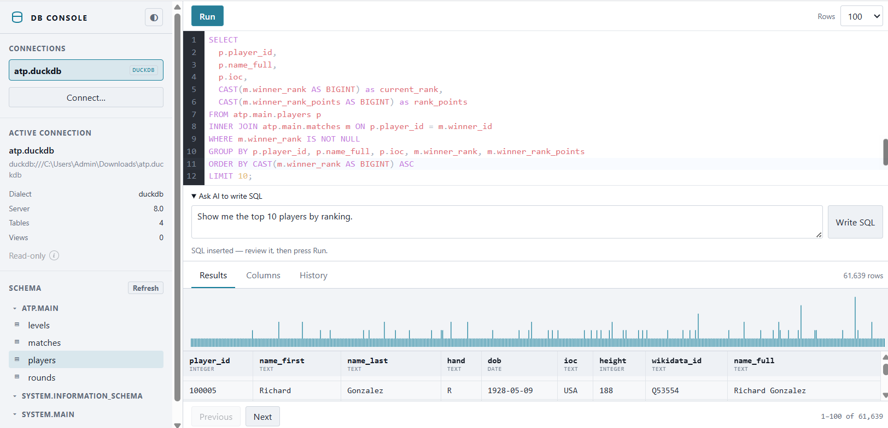

# DB Console

A local SQL console for SQLite, DuckDB, Postgres, MySQL, and MSSQL, with schema browsing and optional AI-assisted SQL drafting.

## What it demonstrates

- Connecting to local database files or remote database URLs through a persistent localhost daemon.
- Read-only-by-default access for SQLite and DuckDB files, a schema tree, paging, sorting, and query history.
- AI-assisted SQL drafting: ask a question, review the generated SQL in the editor, then explicitly run it yourself. The AI receives the dialect and schema metadata, not table rows or connection credentials.

## Run it

Copy this folder into your Fused Render install and open `template.html`.

Choose **Connect** to paste a database URL or open a `.dbconn`, `.sqlite`, or `.duckdb` file. `local_demo.dbconn` points to the included SQLite sample database.

For AI SQL drafting, use a Fused Render version that supports `fused.ai` and has Claude Code installed and authenticated locally. Generated SQL is never executed automatically.

## Files

| File | Role |
|---|---|
| `template.html` | SQL editor, connection UI, results grid, and AI SQL drafting panel |
| `server.py` | Persistent local daemon for database connections, schema inspection, and queries |
| `local_demo.dbconn` | Portable descriptor for the included SQLite demo database |
| `demo.sqlite` | Small local SQLite database for trying the console |
| `icon.svg` | DB Console icon |
