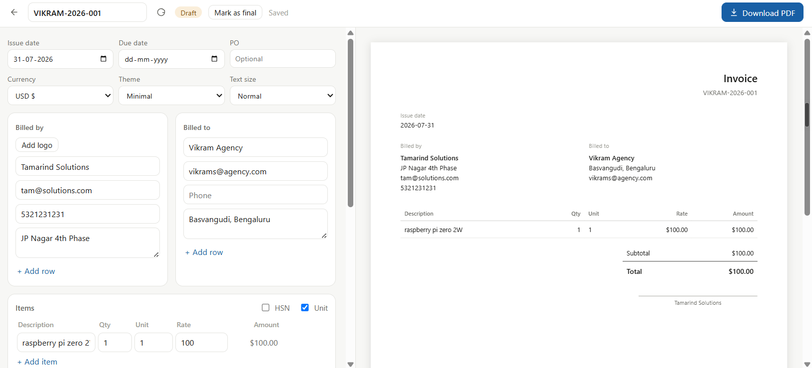

# Invoice Generator

A local invoice manager — clients, line-item invoices, numbering, and
exchange-rate lookups, all stored as plain JSON files on your machine.

## What it demonstrates

Everything lives in `~/.fused-render/data/invoice_generator/`: one
`client.json` per client, one JSON document per invoice. No database — the
backend (`invoice.py`) is a single `main(action=...)` dispatcher, pure
stdlib, that the frontend drives one action at a time (`list_clients`,
`new_invoice`, `save_invoice`, `fx_rate`, ...).

The UI (`template.html`) covers a client list, an invoice editor (line
items, discounts, tax, shipping, multiple themes), autosave with a
save-state indicator, and PDF export via the browser's print dialog. Foreign-
currency invoices pull a same-day exchange rate from a free API
([frankfurter.dev](https://frankfurter.dev)) and cache it to disk, falling
back to the most recent cached rate if you're offline.

## Run it

Copy this folder into your Fused Render install and open `template.html` —
no dependencies to install, no API key required.

## Files

| File | Role |
|---|---|
| `template.html` | The whole UI — client list, invoice editor, themes, print/PDF export |
| `invoice.py` | Backend dispatcher: clients, invoices, numbering, FX rate lookups |
| `icon.svg` | App icon shown in the Fused Render sidebar |
