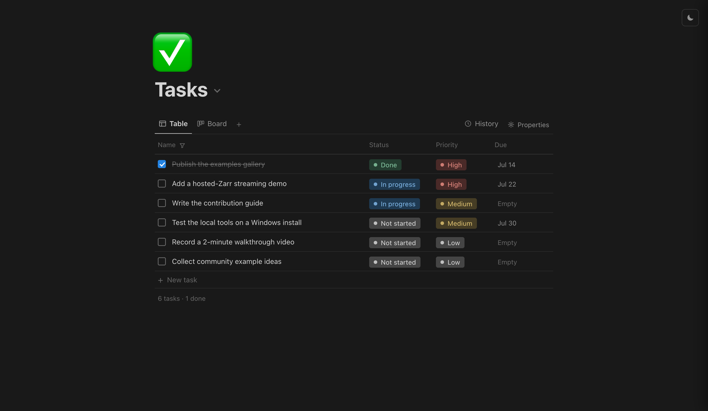

# notion_db

A Notion-style task tracker backed by a local Parquet "data lake", rendered by
Fused Render.

Every write saves a full-state Parquet snapshot, so you get version history for
free. The name refers to the UI styling — there is **no** Notion API and no
token to configure.

## What it demonstrates

Local data-app patterns on Fused Render: a browser UI over a DuckDB/Parquet
store on disk, with snapshot-per-write versioning. Ships with two empty seed
tables (`tasks`, `ideas`) so the UI opens ready to use.

## Run it

Copy this folder into your Fused Render install and open `tasks.html`.

## Files

| File | Role |
|---|---|
| `tasks_db.py` | Bridge entrypoint the UI calls (list/create/update rows and tables) |
| `lake.py` | The Parquet snapshot lake (each write = a new full-state file) |
| `lakectl.py` | CLI over the same lake |
| `tasks.html` | Notion-style task/doc UI |
| `lake/` | Seed Parquet tables |
