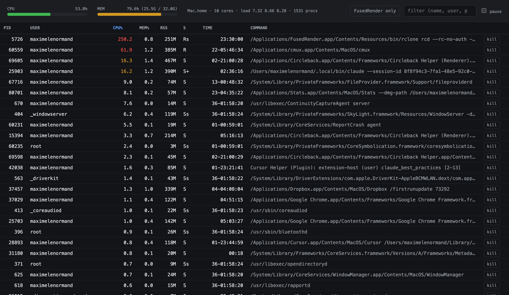

# pytop

A live `top`-style system monitor, rendered in the browser by Fused Render.

CPU and memory meters plus a sortable, killable process table — all driven by
`ps`, `sysctl` and `vm_stat` on the local machine. No dependencies beyond the
standard library.

## What it demonstrates

Fused Render pointed at the **local machine** instead of the cloud: a Python UDF
shells out to the OS, the HTML view polls it a few times a second, and you get a
responsive desktop-app feel from a single `.py` + `.html`.

## Run it

Copy this folder into your Fused Render install and open `pytop.html`. Nothing
to configure.

## Files

| File | Role |
|---|---|
| `pytop.py` | `action=stats` returns CPU/mem/process snapshot; `action=kill` terminates a PID |
| `pytop.html` | Meters + process table, polls `pytop.py` on an interval |
