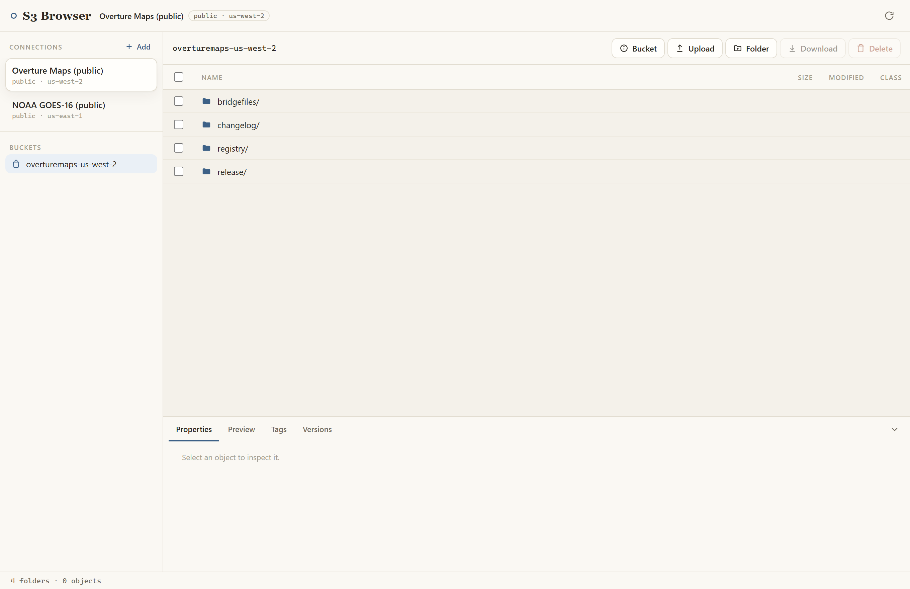

# S3 Browser

A web-based Amazon S3 client — browse buckets, preview objects, and move files, against your own account or any public S3-compatible store.



## What it demonstrates

A full desktop-style app built as one Fused Render view over a botocore backend — no build step, no boto3. Dependencies (botocore, pandas, pyarrow) are declared once in the folder's `pyproject.toml`.

- **Saved connections.** A sidebar of named connections (AWS profile / access keys / anonymous / S3-compatible endpoint), persisted to a git-ignored `accounts.json`. NOAA and Overture public buckets are seeded on first run, so it does something the moment you open it with no credentials. Credentials resolve server-side by account id, so raw keys never travel as `runPython` params (and never enter the call log).
- **Browse & transfer.** Folder navigation, breadcrumbs, multi-select of files *and* folders, continuation-token pagination; recursive local download (chunked) and multipart upload, both with progress; batch/recursive delete, rename, new folder.
- **Inspect.** A per-object dock: properties, preview (the object is fetched to a content-addressed local cache and rendered by fused-render's native viewer for its type — PNG, TIFF, PDF, CSV, Parquet, GeoJSON, text), presigned share URLs (SigV4), tag editor, versions (download + restore), storage-class change.
- **Administer.** A bucket panel: region, versioning toggle, default encryption, public-access-block, a security scan, and policy / CORS / lifecycle JSON editors.

## Run it

Open `s3_browser.html` in Fused Render. It seeds two public buckets you can browse immediately; click **+ Add** to save your own connection (AWS profile, access keys, or an S3-compatible endpoint like Wasabi or MinIO).

## Files

| File | Role |
|---|---|
| `s3_browser.html` | The view — connections sidebar, file table, tabbed object dock, bucket panel. |
| `s3.py` | Action dispatcher (`main(action=…)`) for list / head / presign / tags / versions / delete / rename / bucket config. |
| `s3lib.py` | Shared credential resolution, botocore client construction, error envelope. |
| `preview.py` | Localizes an object to a content-addressed cache so fused-render's native viewer can render it. |
| `download.py` | Chunked recursive local download (`plan` / `step`). |
| `upload.py` | S3 multipart upload (`start` / `part` / `complete` / `abort`). |
| `tests/` | Pytest suite — read ops against public buckets, write ops gated on `S3_TEST_BUCKET`. |

Credentials for keys-based connections live only in a git-ignored `accounts.json`; they are resolved server-side by account id, so they are never sent as call parameters.

## Testing

```
uv run --with pytest --with botocore --with requests --with pandas --with pyarrow \
  python -m pytest tests
```

Read-op tests run against a public bucket with no credentials; write-op tests mutate a bucket you own and skip unless `S3_TEST_BUCKET` (and optionally `S3_TEST_REGION` / `AWS_PROFILE`) is set.
