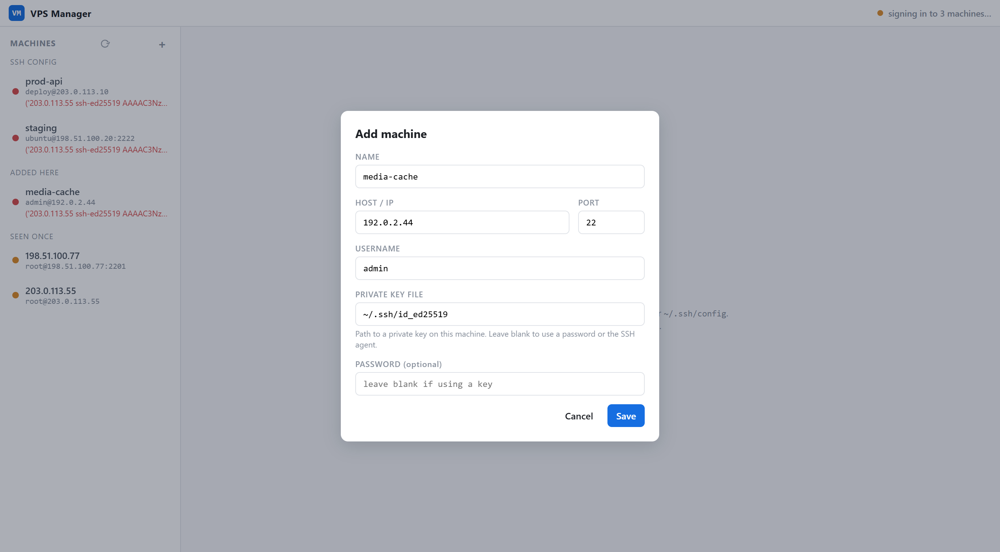

# VPS Manager

Manage all your remote SSH machines — VPS, cloud instances, any host you can
reach over SSH — from a single HTML page.



## What it demonstrates

The machine list builds itself from the SSH files you already have — no
data entry. Every `Host` block in `~/.ssh/config` shows up with its hostname,
port, user and identity file already filled in (`Include`s followed, `Host *`
wildcards applied as defaults, system-wide config read too). Hosts you only
ever logged into once come from `known_hosts`, under *seen once* — click one
and it tries your `~/.ssh` keys and saves whichever one worked. On load, every
machine gets a real login and reports what answered (`Ubuntu 24.04.3 LTS · up 3
weeks`, or the SSH error if not).

Once connected: a file browser (breadcrumbs, copy/move/rename/delete/mkdir,
upload/download, recursive search), a file preview pane that reuses
fused-render's normal extension→template binding, and a real interactive
terminal (xterm.js over an SSH PTY).

Each `runPython` call is a fresh subprocess, so SSH sessions can't live there.
On first load the page starts (or reuses) a long-lived localhost daemon and
then talks to it directly over HTTP and a WebSocket — that daemon holds the
live paramiko connections, shuts down after 30 minutes idle, and works
unchanged on Windows, Linux and macOS (same `~/.ssh` paths on all three; only
the system-wide config directory differs).

The daemon is standard-library only: `ThreadingHTTPServer` serves the REST
routes and a hand-rolled RFC 6455 WebSocket carries the terminal, so
[paramiko](https://www.paramiko.org/) is the only third-party import — no
FastAPI, no uvicorn. Every route but `/ping` is guarded by a per-daemon token
handed back from `ensure()`, since loopback plus open CORS is not an access
boundary on its own.

## Setup

The built-in runPython executor doesn't auto-install dependencies, so install
paramiko once into the interpreter running fused-render:

```
python install.py
```

## Run it

Copy this folder into your Fused Render install and open `index.html`.

## Files

| File | Role |
|---|---|
| `vps.py` | `main(action="ensure")` runPython entrypoint that starts/reuses the daemon; `--serve` runs the daemon itself (machine registry, SFTP file ops, terminal WebSocket) |
| `index.html` | Machine sidebar, file browser + preview pane, terminal |
| `install.py` | One-time `pip install` of the daemon's dependencies into fused-render's interpreter |
| `icon.svg` | Sidebar icon |

Hand-added machines (and any host you save from *seen once*) are written to
`machines.json` beside `vps.py` — gitignored here since it holds your own
hosts, not sample data.

## Notes

- Prefer key files over passwords — a stored password is written to
  `machines.json` in plain text.
- `known_hosts` has no username, no key and no timestamp, so those entries are
  guesses; "most recent" means nearest the end of the file, and hashed entries
  (Ubuntu/Debian's default) can't be read back at all.
- `ProxyJump` hosts are dialled through their jump host; `ProxyCommand` isn't
  supported.
